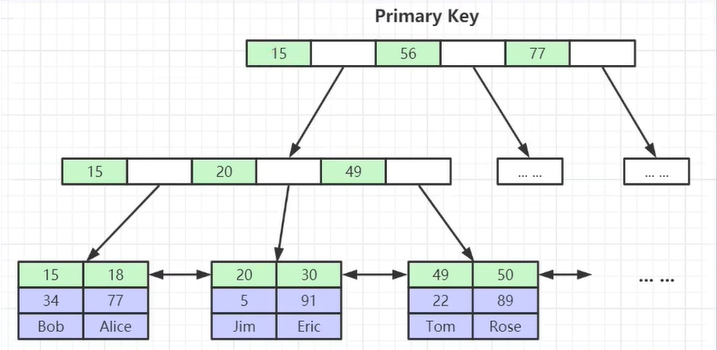
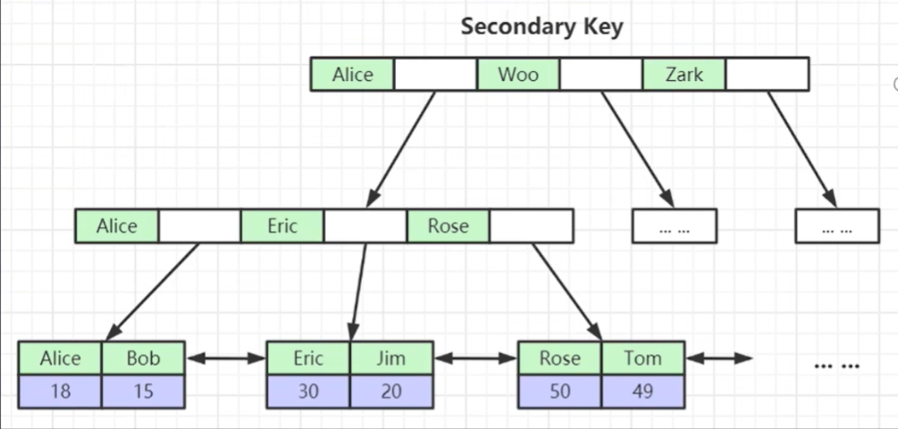

目录
- [备份与恢复](#备份与恢复)
    - [备份](#备份)
    - [恢复](#恢复)
- [连接](#连接)
- [权限修改](#权限修改)
- [索引](#关于索引)
    - [查看索引](#查看索引)
    - [添加索引](#添加索引)
    - [删除索引](#删除索引)
    - [什么是索引](#什么是索引)
    - [为什么需要索引](#为什么需要索引)
    - [索引分类](#索引分类)
    - [数据库的索引方式](#数据库的索引方式)
- [B+树](#B树)
    - [为什么要B+树](#为什么要用b树)
    - [数据结构可视化工具](#数据结构可视化工具)
    - [数据组织](#数据组织)
    - [对比数据结构](#对比二叉树，二叉平衡树，以及B树，B+树)
    - [索引太多的弊端](#为什么不能建太多索引)
- [数据库引擎](#数据库引擎)
    - [MYISAM](#MYISAM)
    - [InnoDB](#InnoDB)
- [虚拟列](#虚拟列)
- [事务](#事务)
    - [隔离性](#隔离性)
    - [一致性](#一致性)
    - [原子性](#原子性)
    - [持久性](#持久性)
- [操作JSON列](#操作JSON列 )
- [一些命令](#一些命令)
  - [查询数据库中哪些表包含这个字段](#查询数据库下哪些表包含某一个字段)
  - [合并数据库](#合并数据库)
  - [日期查询](#日期查询)


# 备份与恢复
## 备份

### mysqldump
使用的时候，不要连进去mysql，连了用不了。  mysqldump和mysql是同一级的  是个工具，不是函数。

### 如果能直接只用 navicat 这种图形化界面的数据库工具，那最好

### 备份数据库
```shell
mysqldump -u user -p db_name > /path/to/source.sql
```

### 备份数据库(只备份结构)
```shell
mysqldump -u user -p --no-data db_name > /path/to/source.sql
```

### 备份部分表
```shell
mysqldump -u user -p db_name table_name1,talbe_name2,... > /path/to/source.sql
```

### 备份部分表(只备份结构)
```shell
mysqldump -u user -p --no-data db_name table_name1,talbe_name2,... > /path/to/source.sql
```

## 恢复

### 写在前面：mysqldump导出的数据，在navicat里面执行，是执行成功的。

### 写在前面：windows：需要找到对应的 mysql/bin 目录下。 cmd 执行连接数据库

### 写在前面： Linux一般来说是可以直接用 mysql 来连接的。应该是加入了全局变量的。
```shell
# TODO 挖个坑后面来填
```

### 连接成功之后，选择的数据库

### 如果不确定有哪些数据库
```shell
show databases;
```

### use 对应的数据库

### 执行资源文件
```shell
source /path/to/source.sql
```

### 提示
```shell
如果是对线上的数据库进行表结构的操作，一定要仔细读一读 source.sql 文件，做到心里有数
还是那句话。任何线上数据库操作之前，记得先备份。
```

# 连接

## 远程连接（remote connection）
``` 
mysql -h 127.0.0.1 -uroot -p
```

# 权限修改
``` txt
所属数据库：mysql
所属数据库表：user
操作指令：
grant 权限名(所有的权限用all) on 库名(*全部).表名(*全部) to  '要授权的用户名'@'%'(表示所有的IP，可以只些一个IP) identified by "密码"
例如修改本地的local数据库让特定的ip拥有所有权限
grant all privileges on local.* to 'root'@'具体的ip地址' identified by '具体的密码'
执行成功之后，刷新权限
update privileges
```
数据库：

```msyql
创建 CREATE USER 'username'@'hostname' IDENTIFIED BY 'password';
GRANT ALL PRIVILEGES ON *.* TO 'root'@'%' IDENTIFIED BY 'qy@mysql1123' WITH GRANT OPTION;
FLUSH PRIVILEGES;
```


grant all privileges on *.* to 'roo'@'172.30.249.113'


GRANT ALL PRIVILEGES ON *.* TO 'root'@'%' IDENTIFIED BY 'qy@mysql1123' WITH GRANT OPTION;
FLUSH PRIVILEGES;

//分配全部表权限
GRANT Alter, Alter Routine, Create, Create Routine, Create Temporary Tables, Create View, Delete, Drop, Event, Execute, Grant Option, Index, Insert, Lock Tables, References, Select, Show View, Trigger, Update ON `register`.* TO `root`@`%`;

# 关于索引
## 对聚合索引加索引，会导致重建索引.并且在此期间，是数据库不可用

## 索引相关的知识和代码

## 查看索引
```sql
SHOW INDEX FROM table_name;
```

## 添加索引
单个索引
```sql
CREATE INDEX index_name ON `table_name` ( column_name )
```


联合索引（即几个字段建立一个索引）
```sql
CREATE INDEX index_name ON `table_name` ( column_name,column_name,... )
```

### 提示：对联合所有里加字段，会导致索引重建。而且重建索引的时候，数据库是不可用的！！！！！！！！！！！！！！
```text
本人有幸经历过，还是线上的数据库，人麻了。万幸的是，这段时间暂时没得人使用。
如果一个索引已经是联合索引，只有万不得已的情况下，才对这个索引加字段。
线上的数据库不建议加。
```

## 删除索引
```mysql
ALTER TABLE `table_name` DROP INDEX `index_name`;
```

### 不过不建议删除。考虑加合适的索引


## 什么是索引

```text
个人感觉索引就是用一种数据结构来组织数据，并排序，方便查找。
```

## 为什么需要索引
```text
为了提高数据的查找的效率。因为数据库不只是存储数据，查找的比重占更多。
在数据库中，数据的量往往非常大，如果没有索引，每次查询都需要遍历整个数据集，导致查询速度变慢。而通过使用索引，可以根据索引的数据结构快速定位到所需数据，大大减少查询的时间复杂度。
TODO 对比有无索引的情况，可以使用数据库查询优化工具（如EXPLAIN语句）来查看查询的执行计划和性能差异。

在没有索引的情况下，查询操作通常需要全表扫描，即遍历整个数据表来查找匹配的数据。而在有索引的情况下，数据库可以利用索引的结构，快速定位到所需数据的位置，避免全表扫描，提高查询效率。
```

## 索引分类
1. 主键索引
2. 唯一索引
3. 普通索引
4. 全文索引
   ...

### 主键索引
```text
主键索引是对表的主键字段建立的索引。主键是用来唯一标识表中每一行数据的字段，它可以保证数据的唯一性和索引的快速查找。
```

### 唯一索引
```text
唯一索引是对表中的某个字段或多个字段建立的索引，用于确保该字段或字段组合的值的唯一性。
跟主键索引不同的是，唯一索引允许有空值（NULL），但字段值不能重复。
```

### 普通索引
```text
普通索引是对表中的某个字段或多个字段建立的索引，用于提高查询效率。普通索引可以包含重复的值，并且允许字段值为NULL。
```

### 全文索引
```text
这个东西用的比较少，可以配合 mysql 的 ngram分词分词工具来使用。不过一般都用ES吧
```

## 数据库的索引方式
1. B-tree 其实是B+树
2. Hash   没用过，不讲

# B+树
官方文档介绍：https://dev.mysql.com/doc/refman/8.0/en/glossary.html#glos_b_tree

## 为什么要用B+树

## 数据结构可视化工具
https://www.cs.usfca.edu/~galles/visualization/BTree.html

## 数据组织
B+树的特点
1. 有序
2. 一个节点先可以有多个子节点
3. 子节点冗余了父节点
4. 一个节点有多个元素
5. 子节点中都有双向指针

## 对比二叉树，二叉平衡树，以及B树，B+树
二叉树，主键递增的话，会变成链表。
二叉平衡树会根据大小排序。但是层级很高。

## 为什么不能建太多索引
因为索引的存储需要空间，增删改某个表的时候，也需要更新这个表的索引
会把索引load进内存进行查找

# 数据库引擎

## MYISAM
MyISAM是MySQL的一种表存储引擎，它使用非聚簇索引。数据和索引分别存储在不同的文件中（.MYD和.MYI文件），索引文件中存储了数据在磁盘上的地址。
在使用索引进行查询时，首先在索引文件中定位到数据的地址，然后在数据文件中读取相应的数据。
如果sql查询走索引的话，先在 .MYI 中定位到要查找数据的地址，并在 .MYD中查找


## InnoDB
聚簇索引
.frm 文件：.frm 文件是表的定义文件，它存储了表的结构和元数据信息，包括列名、数据类型、约束等。该文件对于表的操作和管理非常重要。
.ibd 文件：.ibd 文件是InnoDB表空间文件，它存储了表的数据和索引。每个InnoDB表都有一个独立的 .ibd 文件。它包含了表中的行数据和相关的索引数据。
数据和索引放在一起的 .idb
主键索引 img_2

非主键索引 img_3 非主键索引下面存的是主键


## 索引的底层相关的知识

# 虚拟列

## 给二维的数据添加虚拟列
```shell
alter table `table_name` add `virtral_column` varchar(255) generated always as(`column`->"$[*].conclusion_id") stored;
```

## 给一维的数据添加虚拟列
```shell
alter table `table_name` add `virtral_column` varchar(255) generated always as(`column`->"$.conclusion_id") stored;
```

## 虚拟列导出成sql文件之后，会执行失败
```navicat16
navicat16 直接执行会导致失败，source命令执行没试过
```

# 事务

## 隔离性
### 查看默认的隔离级别
```shell
SELECT @@SESSION.tx_isolation;
```
默认是 REPEATABLE-READ
```txt
意思可重复读
```

### 读未提交
```txt
能够读取到未提交的数据。可能回导致脏读，不可重复度，幻读
```
### 读已提交
```txt
保证事务读取到已经提交的数据，解决了脏读。

[未解决不可重复度]：在事务的过程中，如果有其他事务对数据进行了修改，仍然会导致多次读取的数据不一致。

[未解决幻读]：
```
### 可重复读
```txt
在同一事务中，多次读取的数据是一致的。
[怎么解决不可重复读的：事务开始时，创建一个数据快照，防止其他事务修改影响当前事务。
[未解决幻读]：就是因为事务开始时创建了数据快照，导致其他事务新增、删除数据，不会被查询到。但是在事务的多次查询中似乎出现了新数据，就像幻觉一样。
```
### 串行化
```txt
解决了所有的包括 脏读，不可重复读，幻读 问题。缺点并发能力无了。
所有事务都是串行。
最高级别的隔离。
```

### 根据事务提出的一些问题和答案

1. 为什么可重复度还是不能解决幻读  
   &emsp;**不可重复读(Non-Repeatable Read):** 这个问题指的是在`同一个事务内`，多次读取同一数据，得到的结果不一致。在`“可重复读”`隔离级别下，通过创建`数据快照`来确保事务内多次读取的一致性，避免了不可重复读问题。  
   &emsp;**幻读(Phantom Read)** 这个问题涉及到在同一事务内多次执行查询，结果集中的行数发生了变化，似乎出现了新的数据行。即使使用“可重复 读”隔离级别，因为只是创建了数据快照而没有锁定查询范围，其他事务仍然可以在事务执行过程中插入或删除数据，导致幻读问题。  
   &emsp;决幻读问题需要更严格的控制，而“串行化”隔离级别在这方面提供了解决方案。在“串行化”隔离级别下，会对查询的范围进行锁定，确保在事务执行期间其他事务不能插入或删除相关数据，从而避免了幻读问题。但是，串行化隔离级别会严重影响并发性能，因为它限制了多个事务之间的并发执行。  
   &emsp;因此，尽管“可重复读”隔离级别在某些情况下能够减少幻读问题，但如果要完全消除幻读问题，可能需要使用更高代价的隔离级别，如“串行化”。选择隔离级别时需要权衡数据一致性和并发性能。

2. 可重复读的事务隔离级别，首次查询的时候生成数据快照，然后后面的每次查询都以这个数据快照为准，所以新插入的数据或者新删除的数据不会被查询出来？这个就是幻读。是这个意思吗   
   &emsp;是的，你理解得很正确。在可重复读（REPEATABLE READ）事务隔离级别下，事务在第一次执行查询时会创建一个数据快照，然后后续的每次查询都会使用这个数据快照作为参考，以确保在同一事务内多次读取相同数据时能够得到一致的结果。这就是为什么叫做“可重复读”，因为同一事务内的多次读取会重复地得到相同的数据。  
   &emsp;而，幻读问题并不是因为新插入的数据或删除的数据被查询出来了。幻读问题是指，在可重复读事务隔离级别下，事务在第一次查询时创建了数据快照，然后在事务执行期间，其他事务插入了新数据行（或删除了数据行），这些新数据行在当前事务的数据快照中是看不到的。然而，当当前事务再次执行相同的查询时，它会发现似乎有一些之前不存在的数据行（幻行）出现了，这就是幻读问题。  
   &emsp;所以，你的理解是正确的：幻读问题在可重复读事务隔离级别下出现，是因为数据快照导致事务看不到其他事务插入的新数据行，但在事务的多次查询中，似乎出现了新的数据行，就像是幻觉一样，因此称为幻读。


## 一致性

1. 保持数据一直
## 原子性

1. 已经是不可拆分的。要么全部成功要么全部失败
## 持久性

1. 永久保存

# 操作json列

***mysql version >= 5.7***

> JSON_EXTRACT

1. TABLE: test
2. COLUMNS: data
3. DATA: [{"id": 99}, {"id": 107}, { "id": 127}, {"id": 193}, {"id": 126}]

```sql
select JSON_EXTRACT(data,'$[*].id') from test;
```
> group by

1. TABLE: test
2. COLUMNS: gauge_id,user_id
3. DATA: [{"id": 99}, {"id": 107}, { "id": 127}, {"id": 193}, {"id": 126}]

```sql
select * from test group by gauge_id,user_id;
``` 


> JSON_EXTRACT
1. 解析一层
```sql
 JSON_EXTRACT(COL,'$.answer') 
```
2. 解析两层
```sql
JSON_EXTRACT(COL,'$."answer".conclusion')
```
3. 如果这个字段有为空的
```sql 
CASE WHEN JSON_VALID(col) THEN JSON_EXTRACT(col,'$.answer') ELSE null end
```

> 计算年龄
TIMESTAMPDIFF(YEAR,@birthday,CURTIME()) AS `age`
> IF
```sql
exp: IF(CONDITION,TRUE,NULL)
```

# 一些命令

### 查询数据库下哪些表包含某一个字段
```sql
SELECT
	TABLE_NAME 
FROM
	INFORMATION_SCHEMA.COLUMNS 
WHERE
	COLUMN_NAME = 'col_name' 
	AND TABLE_SCHEMA = 'database_name';
```
用途： 迁移或者合并数据库时，发现数据冲突，通过修改一个的数据合并避免覆盖或者报错

## 合并数据库
```sql
insert into 
    charge_order_new 
select * from charge_order_new3 
where NOT EXISTS 
    (select * from charge_order_new where id = charge_order_new3.id);

```

### 日期查询

```sql

## 获取当月数据
SELECT * FROM user_event WHERE DATE_FORMAT(create_time,'%Y-%m') = DATE_FORMAT(NOW(),'%Y-%m')
    获取3月份数据
sql
SELECT * FROM user_event WHERE DATE_FORMAT(create_time,'%Y-%m') = DATE_FORMAT('2016-03-01','%Y-%m')
    获取三月份数据
sql
SELECT * FROM user_event WHERE YEAR(create_time)='2016' AND MONTH(create_time)='3'
    获取本周数据
    sql
SELECT * FROM user_event WHERE YEARWEEK(DATE_FORMAT(create_time,'%Y-%m-%d')) = YEARWEEK(NOW())
    查询上周的数据
sql
SELECT * FROM user_event WHERE YEARWEEK(DATE_FORMAT(create_time,'%Y-%m-%d')) = YEARWEEK(NOW())-1
    查询距离当前现在6个月的数据
sql
SELECT * FROM user_event WHERE create_time BETWEEN DATE_SUB(NOW(), INTERVAL 6 MONTH) AND NOW()
    查询上个月的数据
sql
SELECT * FROM user_event WHERE DATE_FORMAT(create_time,'%Y-%m') = DATE_FORMAT(DATE_SUB(CURDATE(), INTERVAL 1 MONTH),'%Y-%m')
    查询今天的信息记录
sql
SELECT * FROM user_event WHERE TO_DAYS(`create_time`) = TO_DAYS(NOW())
    查询昨天的信息记录
sql
SELECT * FROM user_event WHERE DATEDIFF(NOW(), create_time) = 1
    查询近7天的信息记录
sql
SELECT * FROM user_event WHERE create_time >= DATE_SUB(NOW(), INTERVAL 7 DAY)
    查询近30天的信息记录
sql
SELECT * FROM user_event WHERE create_time >= DATE_SUB(NOW(), INTERVAL 30 DAY)
    查询上一月的信息记录
sql
SELECT * FROM user_event WHERE create_time >= DATE_SUB(NOW(), INTERVAL 1 MONTH) AND create_time < NOW()
```

# 查询优化
部分查询优化

### 优化 in / no in 查询
```sql
SELECT *
FROM user
where user_id not in (SELECT user_id from team_user)
```
